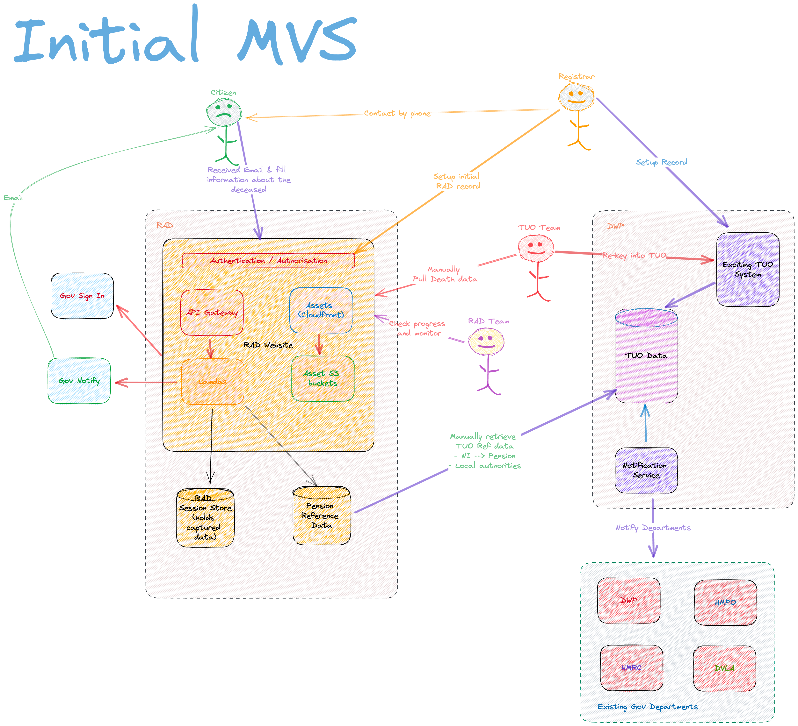
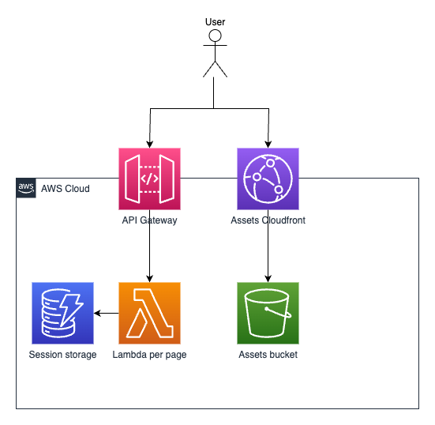

# 2. Report a death High Level Architecture

[Next >>](9999-end.md)

Date: 2023-08-17

## Status

Accepted

## Context
Report a death is built using serverless technologies, as is standard in the Digital Identity programme.

## Initial MVS Architecture
Below is a high level overview of the key components across government services and departments.

### Website components

For accessibility reasons, pages are server-side rendered. This is done using typescript lambdas rendering nunjucks templates. Pages are rendered using nunjucks templates by typescript lambdas. Each page is rendered by a different lambda. These are deployed using AWS SAM. DynamoDB is used for state.

The service is hosted on AWS in the EU-WEST-2 (London) region.

## Decision

This approach follows the agreed pattern of architecture for DI

[Next >>](9999-end.md)
